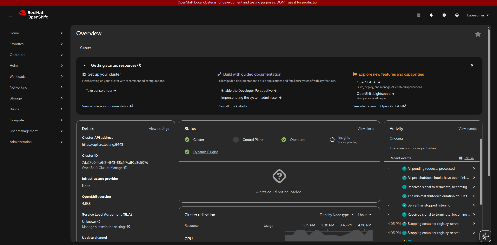
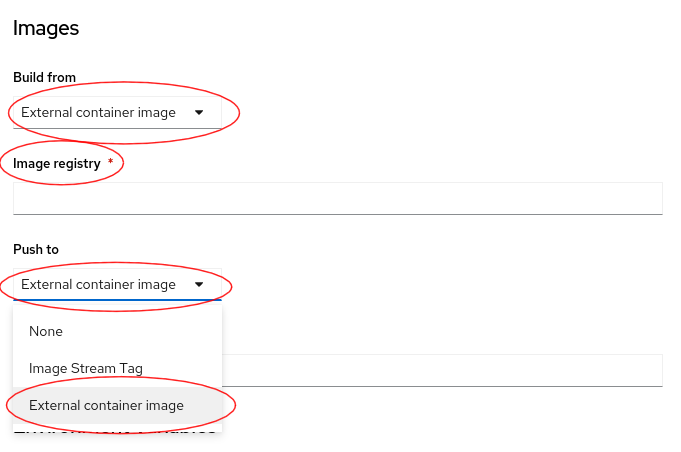
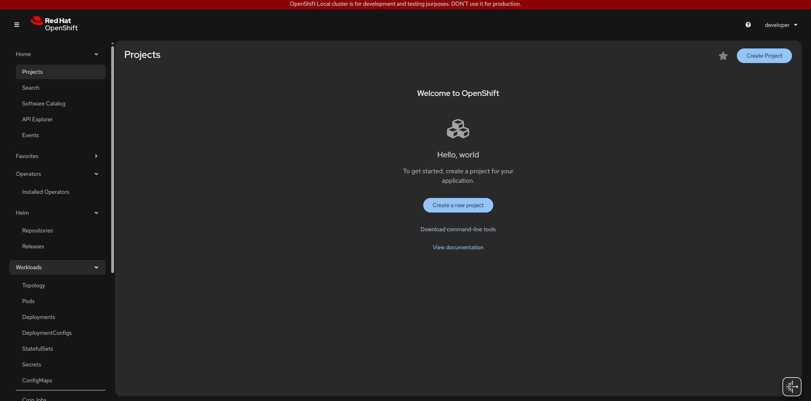
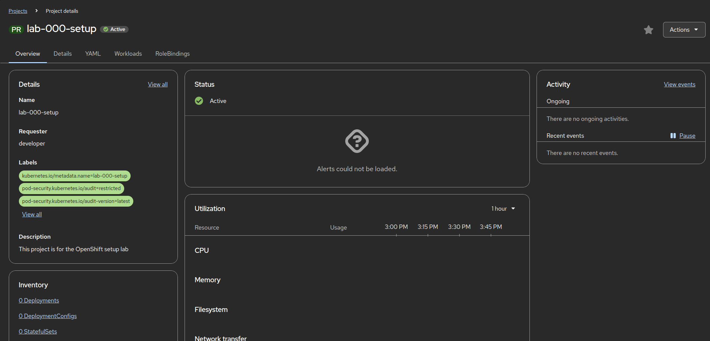
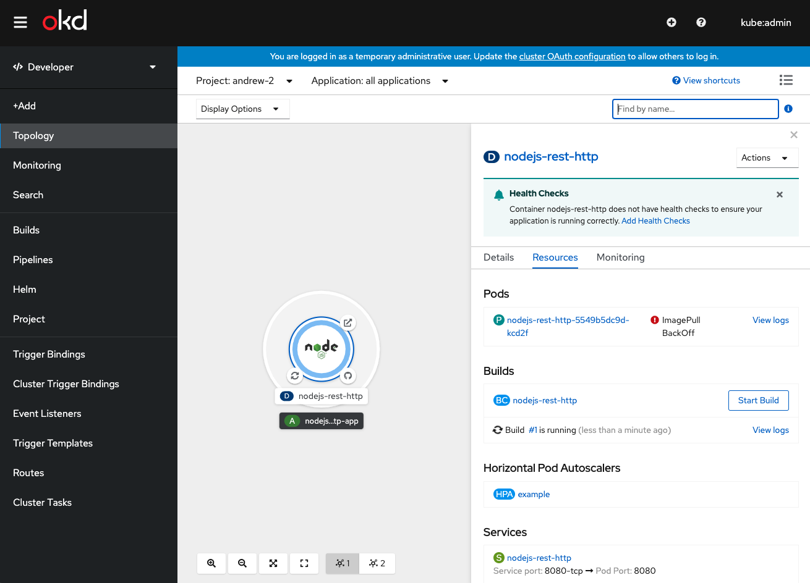
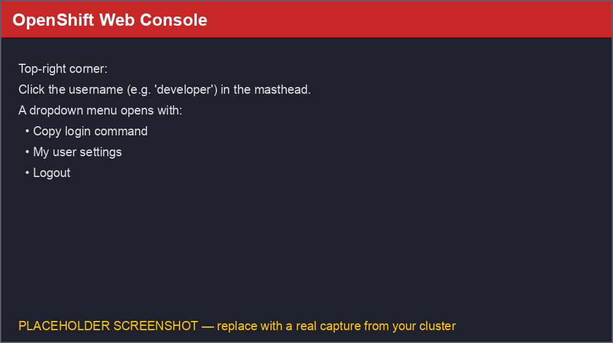
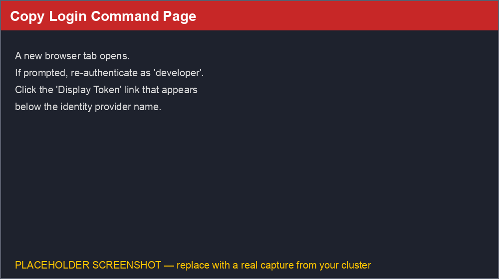
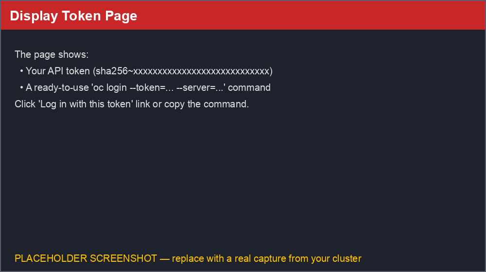
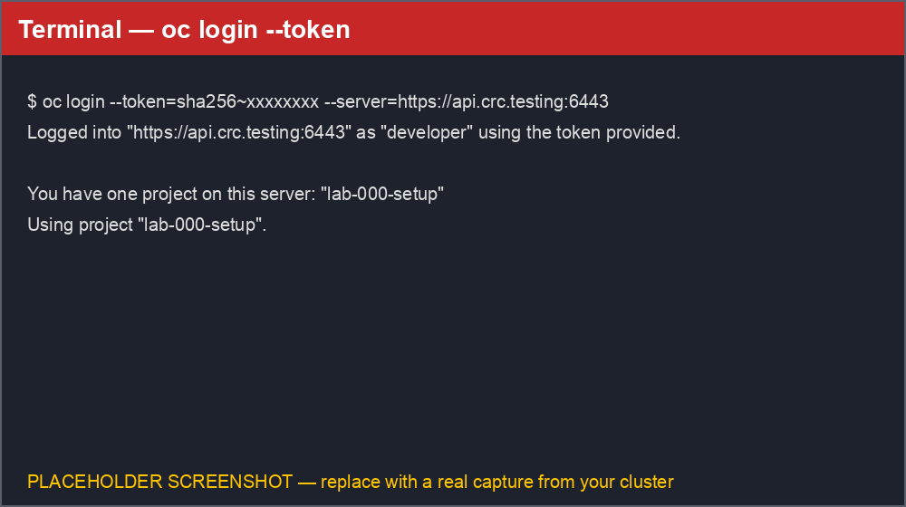

# Lab 000: Installation, Initial Setup & Getting Your Token

## Overview

This lab guides you through setting up OpenShift Local (CRC), installing the `oc` CLI tool, creating your first project, \
and - most importantly - obtaining your personal **OpenShift API token** and using it to log in from the command line. \
We'll learn how to use both the web console and command-line interface.

## Learning Objectives

- Install and start OpenShift Local (CRC)
- Install the `oc` CLI tool
- Access the web console
- Create your first project
- Obtain your OpenShift API token from the web console
- Log in with `oc login --token=...` using that token
- Understand token expiration and how to revoke/refresh a token

## Prerequisites

**System Requirements:**

- **Operating System**: Linux
- **RAM**: Minimum 9 GB RAM (16 GB recommended)
- **CPU**: 4 virtual CPUs minimum
- **Disk Space**: 35 GB of free disk space
- **Virtualization**: Hardware virtualization enabled in BIOS with KVM support

**Software Prerequisites:**

- Administrator/root access on your machine
- A Red Hat account (free to create at https://www.redhat.com)
- Internet connection for downloads
- Web browser (Chrome or Firefox)

---

## Lab Instructions

### Step 1: Install OpenShift Local (CRC) And Get Pull Secret

1. Create a free Red Hat account at https://www.redhat.com
2. Visit https://console.redhat.com/openshift/create/local
3. Download your pull secret (JSON file) - you'll need this during setup

4. Download Linux version of OpenShift Local (CRC) from the same page

5. Extract and install:

   ```bash
   cd ~/Downloads                    # Navigate to Downloads
   tar -xvf crc-linux-*.tar.xz       # Extract the tarball
   cd crc-linux-*-amd64              # Change to extracted directory
   sudo cp crc /usr/local/bin/       # Copy crc binary to /usr/local/bin
   ```

6. Verify installation:

   ```bash
   crc version
   ```

   Expected output:

   ```text
   CRC version: 2.x.x+<commit>
   OpenShift version: 4.x.x
   Podman version: 4.x.x
   ```

7. Run setup:

   ```bash
   crc setup
   ```

   Expected output:

   ```text
   Your system is correctly setup for using CRC. Use 'crc start' to start the instance
   ```

---

### Step 2: Configure CRC Resources (Recommended)

   Before starting, allocate sufficient resources. CRC defaults to 9 GB RAM and 4 CPUs, which may be slow:

   ```bash
   crc config set memory 12288
   crc config set cpus 6
   ```

---

### Step 3: Start OpenShift Local

1. Start CRC (takes 10-15 minutes on first run):

   ```bash
   crc start --pull-secret-file ~/Downloads/pull-secret.txt
   ```

   >Note: CRC may take 10-15 minutes on first start. Use `crc status` to monitor progress.

   Expected output:

   ```text
      INFO All operators are available. Ensuring stability... 
      INFO Operators are stable (2/3)...                
      INFO Operators are stable (3/3)...                
      INFO Adding crc-admin and crc-developer contexts to kubeconfig... 
      Started the OpenShift cluster.

      The server is accessible via web console at:
      https://console-openshift-console.apps-crc.testing

      Log in as administrator:
      Username: kubeadmin
      Password: 9eXcY-tIBcC-2UsDp-NPW5H  # save this password!

      Log in as user:
      Username: developer
      Password: developer

      Use the 'oc' command line interface:
      $ eval $(crc oc-env)
      $ oc login -u developer https://api.crc.testing:6443
   ```

2. Save the credentials from the output:
   - **Web console**: `https://console-openshift-console.apps-crc.testing`
   - **Admin**: username `kubeadmin`, password shown in output
   - **Developer**: username `developer`, password `developer`

3. Verify it's running:

   ```bash
   crc status
   ```

   Expected output:

   ```text
   CRC VM:          Running
   OpenShift:       Running (v4.x.x)
   Podman:          Running
   ```

---

### Step 4: Install the oc CLI Tool

Add CRC's `oc` to your PATH:

```bash
eval $(crc oc-env)                      # Add to current session
echo 'eval $(crc oc-env)' >> ~/.bashrc  # Persist for future sessions
source ~/.bashrc                        # Reload bashrc
```

Verify:

```bash
oc version
```

Expected output (example - versions will vary):

```text
Client Version: 4.19.8
Kubernetes Version: v1.32.0
Server Version: 4.19.8
Kubernetes Version: v1.32.0
```

---

### Step 5: Log in to OpenShift via CLI

Log in as developer:

```bash
oc login -u developer -p developer https://api.crc.testing:6443
```

Expected output:

```text
Login successful.

You don't have any projects. You can try to create a new project, by running

    oc new-project <projectname>
```

Verify your login:

```bash
oc whoami
oc get nodes
```

Expected output:

```text
developer

NAME                 STATUS   ROLES                         AGE   VERSION
crc                  Ready    control-plane,master,worker   10m   v1.xx.x
```

---

### Step 6: Access the Web Console

1. Open your browser and navigate to: `https://console-openshift-console.apps-crc.testing`
2. Accept the SSL certificate warning (safe for local development)
3. Log in as `developer` / `developer`
4. You'll see the OpenShift web console home page

   

   

---

### Step 7: Create Your First Project

1. Click **Home** → **Projects** → **Create Project**

   

2. Fill in the details:
   - **Name**: `lab-000-setup`
   - **Display name**: `Getting Started with OpenShift` (optional)

3. Click **Create**

You are now in your new project context.

---

### Step 8: Project Details

#### Understanding Project Tabs

Once your project is created, you'll see several tabs:

| Tab | Purpose |
|-----|---------|
| **Overview** | Dashboard showing project status, recent activity, and alerts |
| **Details** | Project metadata: name, labels, annotations, requester |
| **YAML** | Raw YAML definition of the project resource (editable) |
| **Workloads** | Lists all workloads (Pods, Deployments, etc.) in this project |
| **RoleBindings** | Manage who has access to this project and with what permissions |





> Note: The Overview tab is your go-to for quick health checks. Use RoleBindings when you need to share project access with teammates.

---

### Step 9: Get Your OpenShift API Token (Web Console)

Every OpenShift user can authenticate to the cluster with a **token** instead of typing a username/password. \
This is the same mechanism used by CI/CD pipelines, `kubectl`/`oc` scripts, and IDE plugins to talk to the cluster, so knowing how to fetch and use your token is an essential skill.

1. Make sure you're logged in to the web console as `developer` (see Step 6).

2. Click your **username** in the top-right corner of the masthead. A dropdown opens:

   

3. Click **Copy login command**.

   > If a new tab opens asking you to choose an identity provider, click it (e.g. `developer` / `htpasswd_provider`) and log in again with your credentials. This re-authentication step generates a fresh, short-lived token for you.

4. On the page that opens, click the **Display Token** link:

   

5. The **Display Token** page now shows your personal API token and a ready-to-use login command:

   

   You'll see something similar to:

   ```text
   Your API token is:

   sha256~AbCdEfGhIjKlMnOpQrStUvWxYz0123456789-ABCDEFGHIJK

   Log in with this token:

   oc login --token=sha256~AbCdEfGhIjKlMnOpQrStUvWxYz0123456789-ABCDEFGHIJK --server=https://api.crc.testing:6443
   ```

   > **Security note:** Treat your token exactly like a password. Anyone with this token can act as you on the cluster until it expires or is revoked. Never commit it to source control or share it in screenshots/logs.

6. Copy the full `oc login --token=... --server=...` command (or just the token value) - you'll use it in the next step.

---

### Step 10: Log In From the CLI Using the Token

Instead of `oc login -u developer -p developer ...`, you can authenticate non-interactively with the token you just copied.

1. Open a terminal and paste the command copied from the **Display Token** page:

   ```bash
   oc login --token=sha256~AbCdEfGhIjKlMnOpQrStUvWxYz0123456789-ABCDEFGHIJK --server=https://api.crc.testing:6443
   ```

   Expected output:

   

   ```text
   Logged into "https://api.crc.testing:6443" as "developer" using the token provided.

   You have one project on this server: "lab-000-setup"

   Using project "lab-000-setup".
   ```

2. Verify you're authenticated as the expected user:

   ```bash
   oc whoami
   ```

   Expected output:

   ```text
   developer
   ```

3. You can always retrieve the token for your **current** CLI session (e.g. to reuse it in another tool, a `curl` request, or a CI pipeline secret) with:

   ```bash
   oc whoami -t
   ```

   Expected output:

   ```text
   sha256~AbCdEfGhIjKlMnOpQrStUvWxYz0123456789-ABCDEFGHIJK
   ```

4. You can also use the token directly with the REST API, for example to list projects with `curl`:

   ```bash
   curl -sk -H "Authorization: Bearer $(oc whoami -t)" \
     https://api.crc.testing:6443/apis/project.openshift.io/v1/projects
   ```

---

### Step 11: Token Expiration, Refresh & Revocation

Tokens obtained via **Copy login command** are short-lived (24 hours by default on OpenShift Local/CRC) for security reasons.

- **Check your current session/context:**

  ```bash
  oc whoami -t   # print the current token
  oc whoami -c   # show the current context, including the server
  ```

- **Get a new token** once the old one expires: simply repeat Step 9 (Copy login command → Display Token) or run `oc login -u developer -p developer https://api.crc.testing:6443` again.

- **Log out and invalidate your local token:**

  ```bash
  oc logout
  ```

  Expected output:

  ```text
  Logged "developer" out on "https://api.crc.testing:6443"
  ```

  > `oc logout` deletes the token from your local kubeconfig and revokes it on the server, so it can no longer be used even if it was copied elsewhere.

---

## Automated Setup Scripts

This repo includes automation scripts to streamline the setup process:

### install-openshift-local.sh

Full automated installation script that checks system requirements, installs dependencies, downloads CRC, and configures everything:

```bash
chmod +x install-openshift-local.sh
./install-openshift-local.sh
```

### _quick-start.sh

Quick setup script for experienced users who already have CRC installed:

```bash
./_quick-start.sh
```

---

## Resource Optimization

### Recommended Settings

For **development** (minimal setup):
```bash
crc config set memory 9216
crc config set cpus 4
crc config set enable-cluster-monitoring false
```

For **testing** (with monitoring):
```bash
crc config set memory 12288
crc config set cpus 6
crc config set enable-cluster-monitoring true
```

### Architecture

OpenShift Local runs as a single-node OpenShift cluster in a virtual machine managed by libvirt/KVM:

```
┌─────────────────────────────────────────────┐
│           Your Linux Host                   │
│                                             │
│  ┌───────────────────────────────────────┐ │
│  │     CRC Virtual Machine (VM)          │ │
│  │                                       │ │
│  │  ┌─────────────────────────────────┐ │ │
│  │  │   OpenShift Control Plane       │ │ │
│  │  │   - API Server                  │ │ │
│  │  │   - Controller Manager          │ │ │
│  │  │   - Scheduler                   │ │ │
│  │  └─────────────────────────────────┘ │ │
│  │                                       │ │
│  │  ┌─────────────────────────────────┐ │ │
│  │  │   OpenShift Worker / Node       │ │ │
│  │  │   - Container Runtime           │ │ │
│  │  │   - Kubelet                     │ │ │
│  │  │   - Your Applications           │ │ │
│  │  └─────────────────────────────────┘ │ │
│  └───────────────────────────────────────┘ │
│              ↑                              │
│         libvirt/KVM                         │
└─────────────────────────────────────────────┘
```

---

## Managing OpenShift Local (CRC)

Useful commands:

```bash
crc stop                    # Stop the cluster
crc start                   # Start the cluster
crc status                  # Check cluster status
crc delete                  # Delete the cluster (removes all data)
crc console --credentials   # View login credentials
crc console                 # Open console in browser
```

---

## Troubleshooting

**Virtualization errors during setup:**

```bash
# Install KVM (Ubuntu/Debian)
sudo apt install qemu-kvm libvirt-daemon libvirt-daemon-system
sudo usermod -aG libvirt $USER
sudo systemctl restart libvirtd
# Log out and back in
```

**Can't access web console:**

- Verify CRC is running: `crc status`
- Check `/etc/hosts` has CRC entries: `cat /etc/hosts | grep crc.testing`
- Accept SSL certificate warning in browser

**oc command not found:**

```bash
eval $(crc oc-env)
```

**`oc login --token=...` fails with "The token provided is invalid or expired":**

- Tokens from **Copy login command** expire (24h by default on CRC). Repeat Step 9 to get a fresh one.
- Make sure you copied the entire token string, including the `sha256~` prefix, with no trailing spaces/newlines.
- Confirm the `--server` URL matches your cluster's API endpoint (`crc console --credentials` or `oc whoami -c` on an already-authenticated session can help verify it).

**"Display Token" link is missing on the Copy login command page:**

- This usually means you're logged in through an identity provider (e.g. `kube:admin` OAuth) that doesn't expose a direct token link in that flow. Log in as `developer` (or another `htpasswd`/OAuth user) and retry.

**Performance issues:**

- Ensure 9GB+ RAM available
- Increase resources if needed:

  ```bash
  crc config set cpus 6
  crc config set memory 12288
  ```

---

## Quick Reference

```bash
# CRC Management
crc start                                                         # Start OpenShift Local
crc stop                                                          # Stop the cluster
crc status                                                        # Check cluster status
crc console --credentials                                         # Show login credentials

# oc CLI - password login
eval $(crc oc-env)                                                # Add oc to PATH
oc login -u developer -p developer https://api.crc.testing:6443   # Log in as developer
oc whoami                                                         # Current user
oc get nodes                                                      # List nodes
oc get projects                                                   # List projects
oc new-project my-project                                         # Create project

# oc CLI - token login
oc login --token=<TOKEN> --server=https://api.crc.testing:6443    # Log in using a copied token
oc whoami -t                                                      # Print the token for the current session
oc logout                                                         # Revoke the current token and log out
```

---

## Next Steps

Continue to [Lab 001: Verify Cluster](../001-verify-cluster/README.md) to learn about cluster health monitoring.
