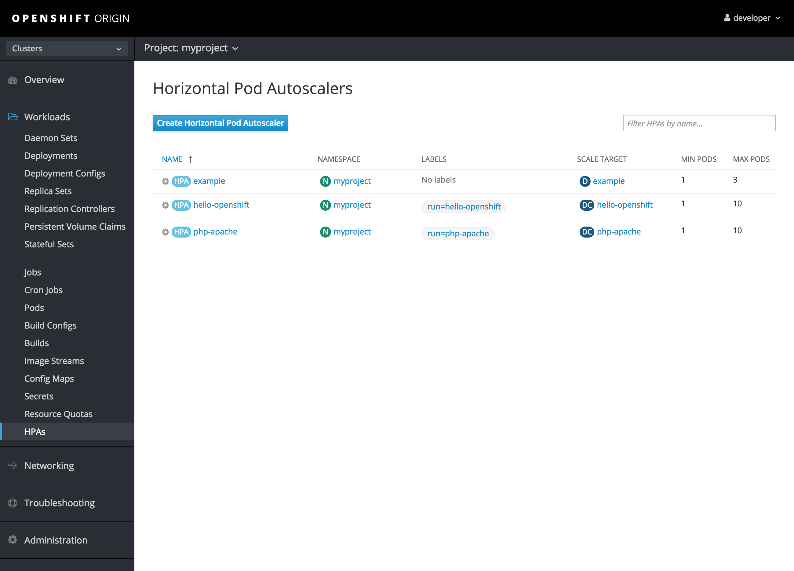
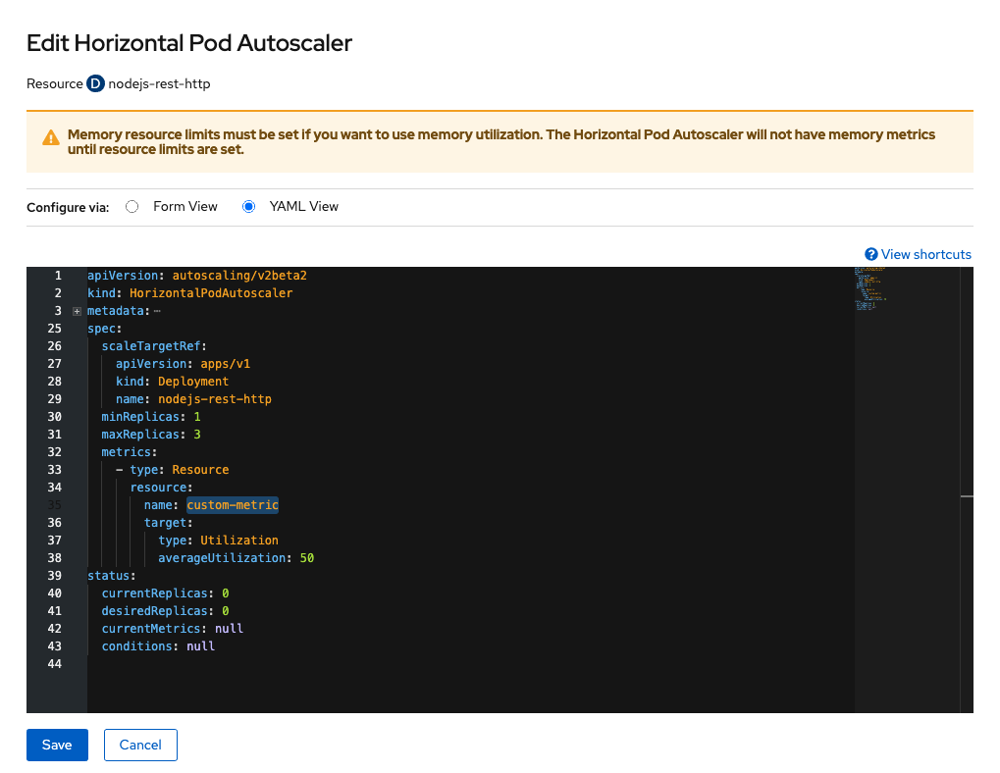
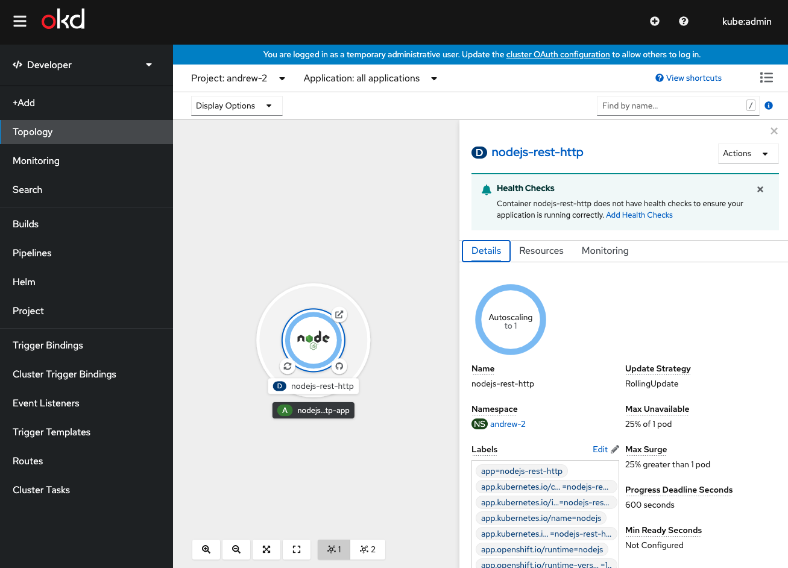

# 012-Scaling — Horizontal Pod Autoscaling and manual scaling

This module covers scaling applications in OpenShift, including manual scaling and automated horizontal pod autoscaling (HPA).

## Objectives

- Manually scale application deployments up and down.
- Configure Horizontal Pod Autoscaler (HPA) based on CPU and memory metrics.
- Test autoscaling behavior under load.

## Tasks

1. Deploy a sample application and manually scale it using `oc scale` command.
2. Create a HorizontalPodAutoscaler resource for the application with CPU threshold.
3. Generate load on the application and observe HPA automatically scaling pods.
4. Review scaling events and metrics in the OpenShift console.

Estimated time: 45–60 minutes
