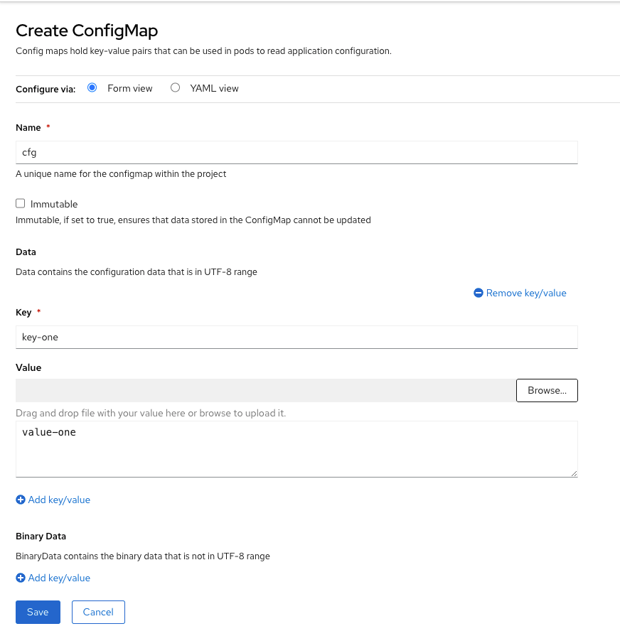
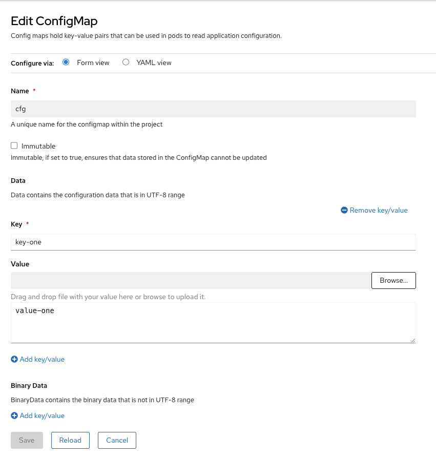

# Lab 013: ConfigMaps and Secrets

## Overview

Learn how to manage application configuration in OpenShift using ConfigMaps and Secrets. These resources decouple configuration artifacts from image content, keeping containerized applications portable.

## Learning Objectives

- Create and manage ConfigMaps from literal values, files, and directories
- Create and manage Secrets for sensitive data
- Mount ConfigMaps and Secrets as environment variables
- Mount ConfigMaps and Secrets as volumes
- Use Secret types for different use cases

## Prerequisites

- Completed previous labs or equivalent experience
- OpenShift cluster running
- oc CLI authenticated

## Lab Instructions

### Step 1: Create a ConfigMap

```bash
# Create a ConfigMap from literal values
oc create configmap app-config \
  --from-literal=APP_ENV=production \
  --from-literal=APP_DEBUG=false \
  --from-literal=APP_PORT=8080

# View the ConfigMap
oc get configmap app-config -o yaml
```



### Step 2: Create a Secret

```bash
# Create a Secret from literal values
oc create secret generic app-secret \
  --from-literal=DB_USERNAME=admin \
  --from-literal=DB_PASSWORD=s3cr3t

# View the Secret (values are base64 encoded)
oc get secret app-secret -o yaml
```



### Step 3: Use ConfigMap as Environment Variables

```bash
# Deploy a pod using ConfigMap values as environment variables
cat <<EOF | oc apply -f -
apiVersion: v1
kind: Pod
metadata:
  name: configmap-demo
spec:
  containers:
  - name: demo
    image: busybox
    command: ["sh", "-c", "env | sort"]
    envFrom:
    - configMapRef:
        name: app-config
  restartPolicy: Never
EOF

# Check the logs to see environment variables
oc logs configmap-demo
```

### Step 4: Use Secret as Environment Variables

```bash
# Deploy a pod using Secret values as environment variables
cat <<EOF | oc apply -f -
apiVersion: v1
kind: Pod
metadata:
  name: secret-demo
spec:
  containers:
  - name: demo
    image: busybox
    command: ["sh", "-c", "env | sort"]
    envFrom:
    - secretRef:
        name: app-secret
  restartPolicy: Never
EOF

# Check the logs (note: values are decrypted for the container)
oc logs secret-demo
```

### Step 5: Mount ConfigMap as Volume

```bash
# Create a ConfigMap containing configuration file content
oc create configmap nginx-config \
  --from-literal=nginx.conf="server {
    listen       8080;
    server_name  localhost;
    location / {
        root   /usr/share/nginx/html;
        index  index.html;
    }
  }"

# Deploy a pod that mounts the ConfigMap as a volume
cat <<EOF | oc apply -f -
apiVersion: v1
kind: Pod
metadata:
  name: configmap-volume-demo
spec:
  containers:
  - name: nginx
    image: nginx:alpine
    volumeMounts:
    - name: config
      mountPath: /etc/nginx/conf.d
  volumes:
  - name: config
    configMap:
      name: nginx-config
EOF
```


### Step 6: Secrets as Pull Secrets

```bash
# Create a docker-registry secret for pulling from private registries
oc create secret docker-registry my-registry-secret \
  --docker-server=docker.io \
  --docker-username=myuser \
  --docker-password=mypassword \
  --docker-email=user@example.com

# Link the secret to the default service account
oc secrets link default my-registry-secret --for=pull
```

## Validation

- Verify ConfigMaps and Secrets are created: `oc get configmap,secret`
- Verify pods can access the values through environment variables
- Verify volume mounts are working correctly

## Troubleshooting

- Use `oc describe` to check pod events
- Use `oc logs` to view pod output
- Check Secret values with `oc get secret -o jsonpath='{.data}'`
