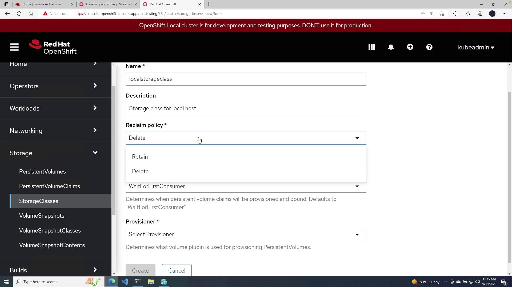
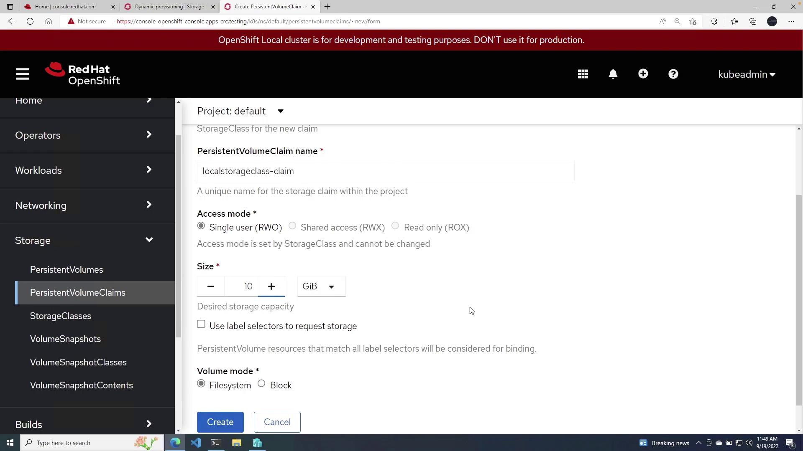
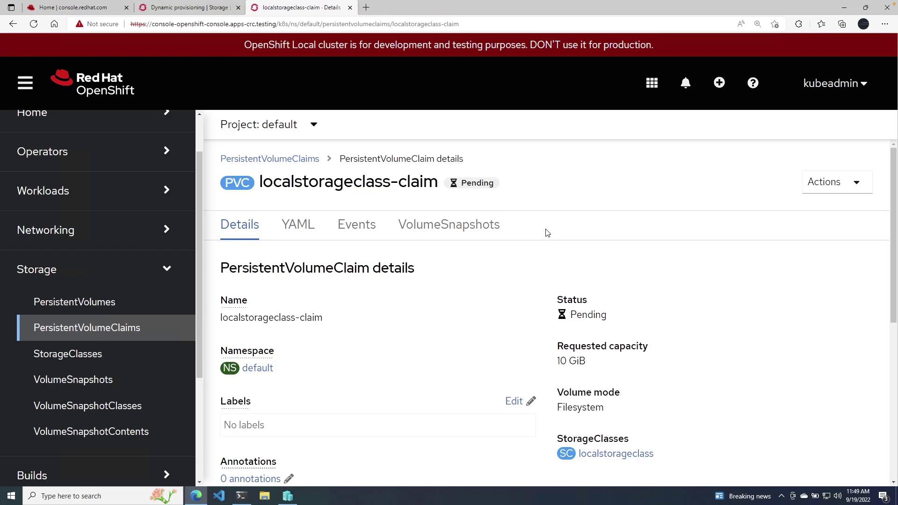

# Lab 014: Persistent Storage

## Overview

Learn how to manage persistent storage in OpenShift using PersistentVolumes (PVs), PersistentVolumeClaims (PVCs), and StorageClasses. Understand how applications can retain data across pod restarts and rescheduling.

## Learning Objectives

- Understand PersistentVolumes and PersistentVolumeClaims
- Create and manage StorageClasses
- Dynamically provision persistent storage
- Use persistent storage in applications
- Understand access modes and reclaim policies

## Prerequisites

- Completed Lab 013: ConfigMaps and Secrets
- OpenShift cluster running
- oc CLI authenticated

## Lab Instructions

### Step 1: Verify StorageClasses

```bash
# List available StorageClasses
oc get storageclass

# View details of a StorageClass
oc describe storageclass <storageclass-name>
```



### Step 2: Create a PersistentVolumeClaim

```bash
# Create a PVC requesting 1Gi of storage
cat <<EOF | oc apply -f -
apiVersion: v1
kind: PersistentVolumeClaim
metadata:
  name: my-pvc
spec:
  accessModes:
    - ReadWriteOnce
  resources:
    requests:
      storage: 1Gi
  storageClassName: crc-csi-hostpath-provisioner  # Use `oc get storageclass` to verify your cluster's default
EOF

# View the PVC and verify it's bound
oc get pvc
oc describe pvc my-pvc
```




### Step 3: Use PVC in a Pod

```bash
# Deploy a pod using the PVC
cat <<EOF | oc apply -f -
apiVersion: v1
kind: Pod
metadata:
  name: storage-demo
spec:
  containers:
  - name: app
    image: busybox
    command: ["sh", "-c", "while true; do echo \$\(date\) >> /data/output.txt; sleep 5; done"]
    volumeMounts:
    - name: storage
      mountPath: /data
  volumes:
  - name: storage
    persistentVolumeClaim:
      claimName: my-pvc
EOF

# Verify data is being written
oc exec storage-demo -- tail -f /data/output.txt
```

### Step 4: Verify Persistence

```bash
# Delete the pod
oc delete pod storage-demo

# Recreate the pod (same PVC)
cat <<EOF | oc apply -f -
apiVersion: v1
kind: Pod
metadata:
  name: storage-demo-2
spec:
  containers:
  - name: app
    image: busybox
    command: ["cat", "/data/output.txt"]
    volumeMounts:
    - name: storage
      mountPath: /data
  volumes:
  - name: storage
    persistentVolumeClaim:
      claimName: my-pvc
  restartPolicy: Never
EOF

# Verify data persisted
oc logs storage-demo-2
```

### Step 5: Access Modes

```bash
# Create PVC with different access modes
cat <<EOF | oc apply -f -
apiVersion: v1
kind: PersistentVolumeClaim
metadata:
  name: my-pvc-rwo
spec:
  accessModes:
    - ReadWriteOnce
  resources:
    requests:
      storage: 500Mi
EOF

cat <<EOF | oc apply -f -
apiVersion: v1
kind: PersistentVolumeClaim
metadata:
  name: my-pvc-rwx
spec:
  accessModes:
    - ReadWriteMany
  resources:
    requests:
      storage: 500Mi
EOF
```

## Validation

- PVC is in "Bound" status
- Data persists after pod deletion and recreation
- Can write and read from mounted volumes

## Troubleshooting

- PVC stuck in "Pending" - check StorageClass availability
- Pod stuck in "ContainerCreating" - verify volume mounting
- Permission denied - check fsGroup settings
