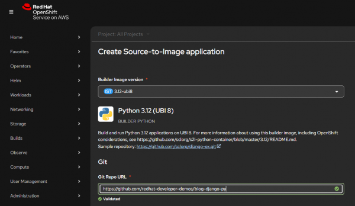

# Lab 016: OpenShift Templates

## Overview

Learn how to create and use OpenShift Templates to define reusable application stacks. Templates parameterize deployment configurations, allowing you to quickly instantiate complex applications with custom values.

## Learning Objectives

- Understand OpenShift Templates structure
- Create parameterized templates
- Use templates to deploy applications
- Process templates with custom parameters
- Share templates across projects

## Prerequisites

- Completed Lab 015: RBAC
- OpenShift cluster running
- oc CLI authenticated

## Lab Instructions

### Step 1: Explore Existing Templates

```bash
# List available templates in openshift namespace
oc get templates -n openshift

# View a template
oc describe template nodejs-example -n openshift
```

### Step 2: Create a Template

```bash
# Create a template for a web application
cat <<'EOF' | oc apply -f -
apiVersion: template.openshift.io/v1
kind: Template
metadata:
  name: web-app-template
  annotations:
    description: "A simple web application template"
    tags: "web,nodejs"
parameters:
- name: APP_NAME
  description: "Application name"
  value: "my-web-app"
- name: IMAGE_TAG
  description: "Image tag to deploy"
  value: "latest"
- name: REPLICAS
  description: "Number of replicas"
  value: "2"
objects:
- apiVersion: v1
  kind: Service
  metadata:
    name: ${APP_NAME}
  spec:
    ports:
    - port: 8080
      targetPort: 8080
    selector:
      app: ${APP_NAME}
- apiVersion: apps/v1
  kind: Deployment
  metadata:
    name: ${APP_NAME}
  spec:
    replicas: ${{REPLICAS}}
    selector:
      matchLabels:
        app: ${APP_NAME}
    template:
      metadata:
        labels:
          app: ${APP_NAME}
      spec:
        containers:
        - name: app
          image: nginx:${IMAGE_TAG}
          ports:
          - containerPort: 8080
EOF
```



### Step 3: Process and Deploy Template

```bash
# Process the template with custom parameters
oc process web-app-template \
  -p APP_NAME=my-app \
  -p IMAGE_TAG=alpine \
  -p REPLICAS=3 \
  -o yaml

# Process and apply directly
oc process web-app-template \
  -p APP_NAME=my-app \
  -p IMAGE_TAG=alpine \
  | oc apply -f -

# Verify deployment
oc get all -l app=my-app
```

### Step 4: Use Template Parameters

```bash
# Process template with different parameters
oc process web-app-template \
  -p APP_NAME=staging-app \
  -p REPLICAS=1 \
  | oc apply -f -

# List all resources created from templates
oc get all
```

### Step 5: Create Multi-Resource Template

```bash
cat <<'EOF' | oc apply -f -
apiVersion: template.openshift.io/v1
kind: Template
metadata:
  name: full-stack-template
parameters:
- name: APP_NAME
  value: "fullstack-app"
- name: DB_PASSWORD
  generate: expression
  from: "[a-zA-Z0-9]{16}"
objects:
- apiVersion: v1
  kind: PersistentVolumeClaim
  metadata:
    name: ${APP_NAME}-data
  spec:
    accessModes:
    - ReadWriteOnce
    resources:
      requests:
        storage: 1Gi
- apiVersion: apps/v1
  kind: Deployment
  metadata:
    name: ${APP_NAME}-db
  spec:
    selector:
      matchLabels:
        app: ${APP_NAME}-db
    template:
      metadata:
        labels:
          app: ${APP_NAME}-db
      spec:
        containers:
        - name: db
          image: postgres:13-alpine
          env:
          - name: POSTGRES_PASSWORD
            value: ${DB_PASSWORD}
EOF
```

## Validation

- Template is created and visible in project
- Resources are created from processed template
- Parameters are properly substituted

## Troubleshooting

- Use `oc process --validate` to check template syntax
- Verify parameter references use correct syntax (${} for strings, ${{}} for numbers)
- Check template objects for valid OpenShift API versions
