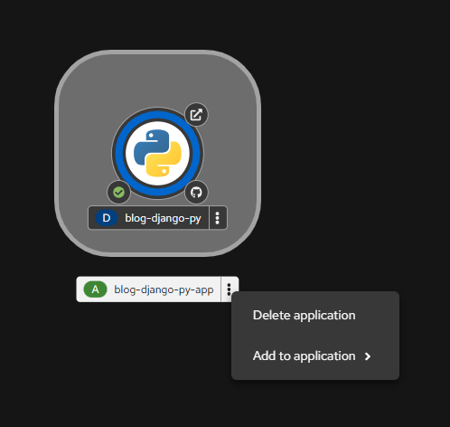
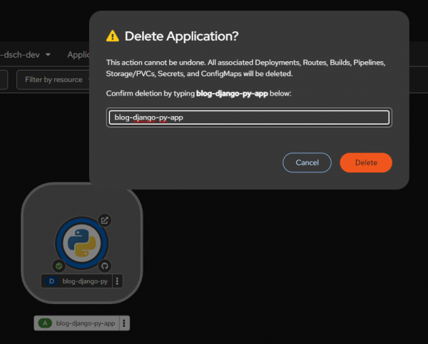

# Lab 017: CI/CD Pipelines

## Overview

Learn how to implement CI/CD pipelines in OpenShift using Jenkins and Tekton. Automate your build, test, and deployment workflows with OpenShift Pipelines.

## Learning Objectives

- Understand OpenShift CI/CD capabilities
- Deploy and configure Jenkins on OpenShift
- Create Jenkins pipelines for build and deploy
- Use OpenShift Pipelines (Tekton)
- Integrate with Git webhooks

## Prerequisites

- Completed Lab 016: Templates
- OpenShift cluster running
- oc CLI authenticated with cluster-admin privileges

## Lab Instructions

### Step 1: Explore CI/CD Capabilities

```bash
# Check available pipeline templates
oc get templates -n openshift | grep -i pipeline

# View the pipeline template
oc describe template pipeline -n openshift
```

### Step 2: Deploy a Jenkins Instance

```bash
# Deploy Jenkins using OpenShift template
oc new-app jenkins-persistent \
  -p MEMORY_LIMIT=2Gi \
  -p VOLUME_CAPACITY=5Gi

# Wait for Jenkins to start
oc get pods -w

# Get the Jenkins route
oc get route jenkins
```

### Step 3: Create a BuildConfig with Source-to-Image

```bash
# Create a BuildConfig
cat <<EOF | oc apply -f -
apiVersion: build.openshift.io/v1
kind: BuildConfig
metadata:
  name: nodejs-app
spec:
  source:
    type: Git
    git:
      uri: https://github.com/sclorg/nodejs-ex
  strategy:
    type: Source
    sourceStrategy:
      from:
        kind: ImageStreamTag
        name: nodejs:18-ubi8
  output:
    to:
      kind: ImageStreamTag
      name: nodejs-app:latest
EOF

# Trigger a build
oc start-build nodejs-app

# Watch the build logs
oc logs -f build/nodejs-app-1
```

### Step 4: Create a Pipeline BuildConfig

```bash
cat <<EOF | oc apply -f -
apiVersion: build.openshift.io/v1
kind: BuildConfig
metadata:
  name: nodejs-pipeline
spec:
  strategy:
    type: JenkinsPipeline
    jenkinsPipelineStrategy:
      jenkinsfile: |-
        pipeline {
            agent any
            stages {
                stage('Checkout') {
                    steps {
                        checkout scm
                    }
                }
                stage('Build') {
                    steps {
                        echo 'Building application...'
                    }
                }
                stage('Test') {
                    steps {
                        echo 'Running tests...'
                    }
                }
                stage('Deploy') {
                    steps {
                        echo 'Deploying application...'
                    }
                }
            }
        }
EOF
```



### Step 5: OpenShift Pipelines (Tekton)

```bash
# Check if Tekton operator is installed
oc get pods -n openshift-pipelines

# Install Tekton operator (if not present)
cat <<EOF | oc apply -f -
apiVersion: operators.coreos.com/v1alpha1
kind: Subscription
metadata:
  name: openshift-pipelines-operator
  namespace: openshift-operators
spec:
  channel: stable
  name: openshift-pipelines-operator-rh
  source: redhat-operators
  sourceNamespace: openshift-marketplace
EOF
```



## Validation

- Jenkins is accessible via route
- BuildConfig triggers builds successfully
- Pipeline stages execute in sequence
- Images are pushed to internal registry

## Troubleshooting

- Check Jenkins logs: `oc logs deployment/jenkins`
- Monitor builds: `oc get builds`
- Check pipeline runs: `oc get pipelineruns`
