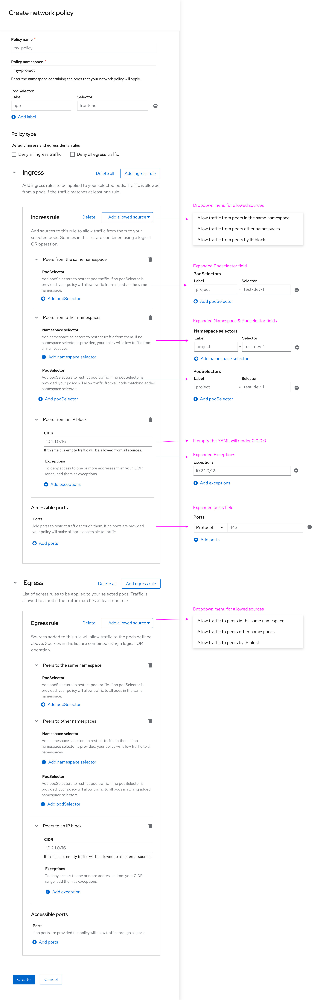
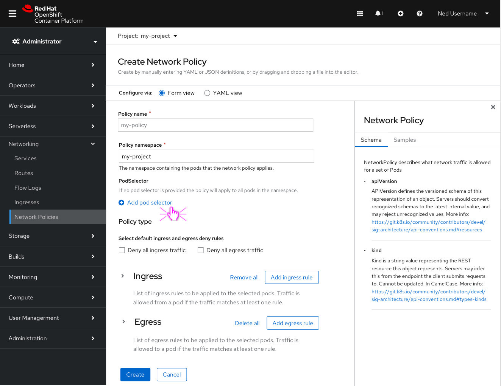
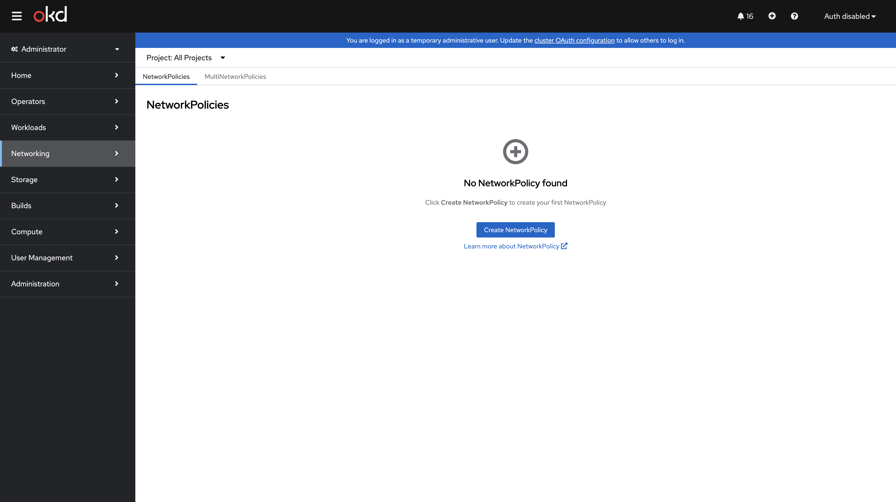

# Lab 018: Network Policies

## Overview

Learn how to implement Network Policies in OpenShift to control traffic flow between pods. Network Policies act as a firewall for your Kubernetes pods, allowing you to define ingress and egress rules.

## Learning Objectives

- Understand Network Policy concepts in OpenShift
- Create Network Policies to restrict pod communication
- Implement ingress and egress rules
- Use pod selectors and namespace selectors
- Test network isolation

## Prerequisites

- Completed Lab 017: CI/CD Pipelines
- OpenShift cluster with network policy support
- oc CLI authenticated

## Lab Instructions

### Step 1: Verify Network Policy Support

```bash
# Check if the cluster supports NetworkPolicy
oc api-resources | grep networkpolicy

# Check the default network plugin
oc get network.operator.openshift.io cluster -o jsonpath='{.spec.defaultNetwork.type}'
```

### Step 2: Deploy Test Applications

```bash
# Create test namespaces
oc new-project np-frontend
oc new-project np-backend
oc new-project np-database

# Deploy test pods in each namespace
oc run frontend --image=nginx -n np-frontend
oc run backend --image=nginx -n np-backend
oc run database --image=nginx -n np-database

# Expose services
oc expose pod frontend --port=80 -n np-frontend
oc expose pod backend --port=80 -n np-backend
oc expose pod database --port=80 -n np-database

# Test connectivity (should work initially)
oc exec -n np-frontend pod/frontend -- curl -s http://backend.np-backend:80
```

### Step 3: Default Deny Ingress



```bash
# Apply default deny ingress policy
cat <<EOF | oc apply -f -
apiVersion: networking.k8s.io/v1
kind: NetworkPolicy
metadata:
  name: default-deny-ingress
  namespace: np-backend
spec:
  podSelector: {}
  policyTypes:
  - Ingress
EOF

# Test connectivity (should now fail)
oc exec -n np-frontend pod/frontend -- curl -s --connect-timeout 5 http://backend.np-backend:80
```





### Step 4: Allow Specific Traffic

```bash
# Allow traffic from frontend namespace
cat <<EOF | oc apply -f -
apiVersion: networking.k8s.io/v1
kind: NetworkPolicy
metadata:
  name: allow-frontend
  namespace: np-backend
spec:
  podSelector: {}
  ingress:
  - from:
    - namespaceSelector:
        matchLabels:
          kubernetes.io/metadata.name: np-frontend
  policyTypes:
  - Ingress
EOF

# Test connectivity (should work again)
oc exec -n np-frontend pod/frontend -- curl -s http://backend.np-backend:80
```

### Step 5: Allow Specific Ports

```bash
# Restrict to specific port only
cat <<EOF | oc apply -f -
apiVersion: networking.k8s.io/v1
kind: NetworkPolicy
metadata:
  name: allow-frontend-port80
  namespace: np-backend
spec:
  podSelector: {}
  ingress:
  - from:
    - namespaceSelector:
        matchLabels:
          kubernetes.io/metadata.name: np-frontend
    ports:
    - port: 80
  policyTypes:
  - Ingress
EOF
```

### Step 6: Egress Policies

```bash
# Apply egress policy
cat <<EOF | oc apply -f -
apiVersion: networking.k8s.io/v1
kind: NetworkPolicy
metadata:
  name: restrict-egress
  namespace: np-backend
spec:
  podSelector: {}
  egress:
  - to:
    - namespaceSelector:
        matchLabels:
          kubernetes.io/metadata.name: np-database
    ports:
    - port: 80
  policyTypes:
  - Egress
EOF
```

## Validation

- Default deny policy blocks all ingress traffic
- Allow policies permit specific traffic
- Port restrictions work correctly
- Egress policies control outbound traffic

## Troubleshooting

- Use `oc describe networkpolicy` to view rules
- Check network plugin logs: `oc logs -n openshift-ovn-kubernetes daemonset/ovnkube-master` (OVN-Kubernetes) or for older clusters use `openshift-sdn`
- Verify namespace labels match selectors
