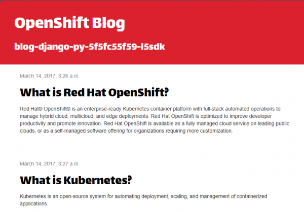

# Lab 020: Health Probes

## Overview

Learn how to configure health probes in OpenShift to ensure your applications are running correctly. Kubernetes uses liveness, readiness, and startup probes to manage container health and traffic routing.

## Learning Objectives

- Understand liveness, readiness, and startup probes
- Configure HTTP, TCP, and command-based probes
- Implement proper probe timing and thresholds
- Test probe behavior with failing containers
- Use probes for zero-downtime deployments

## Prerequisites

- Completed Lab 019: Resource Quotas and Limits
- OpenShift cluster running
- oc CLI authenticated

## Lab Instructions

### Step 1: Create an Application with Liveness Probe

```bash
# Create a deployment with a liveness probe
cat <<EOF | oc apply -f -
apiVersion: apps/v1
kind: Deployment
metadata:
  name: liveness-demo
spec:
  replicas: 1
  selector:
    matchLabels:
      app: liveness-demo
  template:
    metadata:
      labels:
        app: liveness-demo
    spec:
      containers:
      - name: app
        image: nginx:alpine
        livenessProbe:
          httpGet:
            path: /
            port: 80
          initialDelaySeconds: 5
          periodSeconds: 10
          timeoutSeconds: 5
          failureThreshold: 3
EOF

# Watch the pod status
oc get pods -w
```



### Step 2: Test Liveness Probe Failure

```bash
# Create a deployment with a liveness probe on nginx's default page (served at /)
cat <<EOF | oc apply -f -
apiVersion: apps/v1
kind: Deployment
metadata:
  name: failing-liveness
spec:
  replicas: 1
  selector:
    matchLabels:
      app: failing-liveness
  template:
    metadata:
      labels:
        app: failing-liveness
    spec:
      containers:
      - name: app
        image: nginx:alpine
        command: ["/bin/sh", "-c"]
        args:
        - |
          nginx -g 'daemon off;' &
          sleep 10
          rm /usr/share/nginx/html/index.html
          sleep 3600
        livenessProbe:
          httpGet:
            path: /
            port: 80
          initialDelaySeconds: 5
          periodSeconds: 5
EOF

# Watch the pod restart (nginx serves / until index.html is deleted, then returns 404 → probe fails → pod restarts)
oc get pods -w
```

### Step 3: Readiness Probe

```bash
# Create a deployment with a readiness probe using nginx's default endpoint
cat <<EOF | oc apply -f -
apiVersion: apps/v1
kind: Deployment
metadata:
  name: readiness-demo
spec:
  replicas: 3
  selector:
    matchLabels:
      app: readiness-demo
  template:
    metadata:
      labels:
        app: readiness-demo
    spec:
      containers:
      - name: app
        image: nginx:alpine
        ports:
        - containerPort: 80
        readinessProbe:
          httpGet:
            path: /
            port: 80
          initialDelaySeconds: 3
          periodSeconds: 5
          successThreshold: 1
          failureThreshold: 3
---
apiVersion: v1
kind: Service
metadata:
  name: readiness-demo
spec:
  selector:
    app: readiness-demo
  ports:
  - port: 80
EOF
```

### Step 4: TCP Probe

```bash
# Create a deployment with a TCP socket probe
cat <<EOF | oc apply -f -
apiVersion: apps/v1
kind: Deployment
metadata:
  name: tcp-probe-demo
spec:
  replicas: 2
  selector:
    matchLabels:
      app: tcp-probe-demo
  template:
    metadata:
      labels:
        app: tcp-probe-demo
    spec:
      containers:
      - name: app
        image: nginx:alpine
        livenessProbe:
          tcpSocket:
            port: 80
          initialDelaySeconds: 5
          periodSeconds: 10
EOF
```

### Step 5: Command Probe

```bash
# Create a deployment with an exec probe
cat <<EOF | oc apply -f -
apiVersion: apps/v1
kind: Deployment
metadata:
  name: exec-probe-demo
spec:
  replicas: 1
  selector:
    matchLabels:
      app: exec-probe-demo
  template:
    metadata:
      labels:
        app: exec-probe-demo
    spec:
      containers:
      - name: app
        image: nginx:alpine
        livenessProbe:
          exec:
            command:
            - cat
            - /tmp/healthy
          initialDelaySeconds: 5
          periodSeconds: 5
EOF
```

### Step 6: Startup Probe (for slow-starting apps)

```bash
# Create a deployment with a startup probe
cat <<EOF | oc apply -f -
apiVersion: apps/v1
kind: Deployment
metadata:
  name: startup-probe-demo
spec:
  replicas: 1
  selector:
    matchLabels:
      app: startup-probe-demo
  template:
    metadata:
      labels:
        app: startup-probe-demo
    spec:
      containers:
      - name: app
        image: nginx:alpine
        command: ["/bin/sh", "-c"]
        args:
        - |
          sleep 30
          nginx -g "daemon off;"
        startupProbe:
          httpGet:
            path: /
            port: 80
          initialDelaySeconds: 5
          periodSeconds: 5
          failureThreshold: 30
        livenessProbe:
          httpGet:
            path: /
            port: 80
          initialDelaySeconds: 5
          periodSeconds: 5
EOF
```

## Validation

- Liveness probe restarts unhealthy containers
- Readiness probe controls traffic routing
- TCP probe checks socket availability
- Command probe runs custom check scripts
- Startup probe gives slow apps time to start

## Troubleshooting

- Check probe status: `oc describe pod <name>`
- View probe events: `oc get events --field-selector involvedObject.name=<pod-name>`
- Probe timeout thresholds may need tuning for slow applications

## Next Lab

Continue to [Lab 021: Example Voting Application](../021-example-voting-app/README.md) to combine everything you've learned into a full multi-tier deployment.
