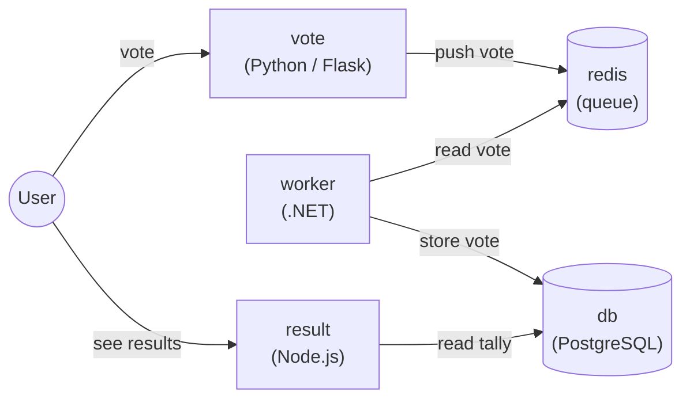

# Lab 021: Example Voting Application (Capstone)

## Overview

This capstone lab ties together everything from the previous labs by deploying a
complete, multi-tier microservices application on OpenShift: the well-known
**Example Voting App**. You will deploy five interconnected components across
different languages and runtimes, wire them together with Services, expose the
user-facing tiers with Routes, and back the database with persistent storage.

The application lets users vote between two options (Cats vs Dogs). Votes flow
through a Redis queue, are processed by a background worker, persisted in
PostgreSQL, and displayed in real time by a results page.

## Learning Objectives

- Deploy a realistic, polyglot microservices application on OpenShift
- Connect components using internal `Services` (service discovery by name)
- Expose front-end tiers to users with `Routes`
- Back a stateful database with a `PersistentVolumeClaim`
- Understand how OpenShift Security Context Constraints (SCC) affect community images
- Validate an end-to-end request flow across five services

## Architecture



| Component | Runtime | Role | Exposed |
|-----------|---------|------|---------|
| `vote`   | Python / Flask | Front-end where users cast a vote | Route |
| `redis`  | Redis | In-memory queue holding new votes | Internal only |
| `worker` | .NET | Consumes votes from Redis, writes to Postgres | Internal only |
| `db`     | PostgreSQL | Stores the vote tally | Internal only |
| `result` | Node.js | Front-end showing live results | Route |

## Prerequisites

- Completed Lab 008 (Deployments), Lab 009 (Services & Routes), and Lab 014 (Persistent Storage)
- OpenShift cluster running and `oc` CLI authenticated
- A project to work in (create one below)

---

## Background: Why this app on OpenShift

The Example Voting App is a language-agnostic reference application. It is a good
capstone because each tier exercises a different OpenShift concept:

- **Service discovery**: Components find each other by Service name (`redis`, `db`)
  - no hard-coded IPs. OpenShift's internal DNS resolves the Service name to a
  stable ClusterIP.
- **Stateless vs stateful**: `vote`, `result`, and `worker` are stateless and can
  scale freely. `db` is stateful and needs a `PersistentVolumeClaim`.
- **Security Context Constraints (SCC)**: By default OpenShift runs containers with
  a random, non-root UID under the `restricted-v2` SCC. Community images that
  assume a fixed UID (like the official `postgres` and `redis` images) may need an
  adjusted SCC. This lab shows how to handle that cleanly.

---

## Lab Instructions

### Step 1: Create the project

```bash
oc new-project voting-app --display-name="Example Voting App"
```

### Step 2: Deploy Redis (vote queue)

```bash
cat <<EOF | oc apply -f -
apiVersion: apps/v1
kind: Deployment
metadata:
  name: redis
  labels:
    app: redis
spec:
  replicas: 1
  selector:
    matchLabels:
      app: redis
  template:
    metadata:
      labels:
        app: redis
    spec:
      containers:
      - name: redis
        image: redis:alpine
        ports:
        - containerPort: 6379
        readinessProbe:
          tcpSocket:
            port: 6379
          initialDelaySeconds: 5
          periodSeconds: 10
---
apiVersion: v1
kind: Service
metadata:
  name: redis
  labels:
    app: redis
spec:
  selector:
    app: redis
  ports:
  - port: 6379
    targetPort: 6379
EOF
```

### Step 3: Deploy PostgreSQL (persistent database)

The database needs persistent storage and a fixed user. Because the official
`postgres` image expects to run as its own user, grant the project's default
service account the `anyuid` SCC first (cluster-admin required).

```bash
# Allow the postgres image to run as its built-in UID (needs cluster-admin)
oc adm policy add-scc-to-user anyuid -z default -n voting-app
```

```bash
cat <<EOF | oc apply -f -
apiVersion: v1
kind: PersistentVolumeClaim
metadata:
  name: db-data
spec:
  accessModes:
  - ReadWriteOnce
  resources:
    requests:
      storage: 1Gi
---
apiVersion: apps/v1
kind: Deployment
metadata:
  name: db
  labels:
    app: db
spec:
  replicas: 1
  selector:
    matchLabels:
      app: db
  template:
    metadata:
      labels:
        app: db
    spec:
      containers:
      - name: postgres
        image: postgres:15-alpine
        ports:
        - containerPort: 5432
        env:
        - name: POSTGRES_USER
          value: postgres
        - name: POSTGRES_PASSWORD
          value: postgres
        - name: PGDATA
          value: /var/lib/postgresql/data/pgdata
        volumeMounts:
        - name: db-data
          mountPath: /var/lib/postgresql/data
        readinessProbe:
          exec:
            command: ["pg_isready", "-U", "postgres"]
          initialDelaySeconds: 10
          periodSeconds: 10
      volumes:
      - name: db-data
        persistentVolumeClaim:
          claimName: db-data
---
apiVersion: v1
kind: Service
metadata:
  name: db
  labels:
    app: db
spec:
  selector:
    app: db
  ports:
  - port: 5432
    targetPort: 5432
EOF
```

> **Note:** The `worker` and `result` components connect to the database using the
> Service name `db` with user `postgres` / password `postgres`, matching the
> environment variables above.

### Step 4: Deploy the Worker (.NET)

```bash
cat <<EOF | oc apply -f -
apiVersion: apps/v1
kind: Deployment
metadata:
  name: worker
  labels:
    app: worker
spec:
  replicas: 1
  selector:
    matchLabels:
      app: worker
  template:
    metadata:
      labels:
        app: worker
    spec:
      containers:
      - name: worker
        image: dockersamples/examplevotingapp_worker:latest
EOF
```

The worker has no Service and no Route - it only talks to `redis` and `db`
internally.

### Step 5: Deploy the Vote front-end (Python)

```bash
cat <<EOF | oc apply -f -
apiVersion: apps/v1
kind: Deployment
metadata:
  name: vote
  labels:
    app: vote
spec:
  replicas: 1
  selector:
    matchLabels:
      app: vote
  template:
    metadata:
      labels:
        app: vote
    spec:
      containers:
      - name: vote
        image: dockersamples/examplevotingapp_vote:latest
        ports:
        - containerPort: 80
        readinessProbe:
          httpGet:
            path: /
            port: 80
          initialDelaySeconds: 5
          periodSeconds: 10
---
apiVersion: v1
kind: Service
metadata:
  name: vote
  labels:
    app: vote
spec:
  selector:
    app: vote
  ports:
  - port: 80
    targetPort: 80
EOF

# Expose the vote front-end to users
oc expose svc/vote
```

### Step 6: Deploy the Result front-end (Node.js)

```bash
cat <<EOF | oc apply -f -
apiVersion: apps/v1
kind: Deployment
metadata:
  name: result
  labels:
    app: result
spec:
  replicas: 1
  selector:
    matchLabels:
      app: result
  template:
    metadata:
      labels:
        app: result
    spec:
      containers:
      - name: result
        image: dockersamples/examplevotingapp_result:latest
        ports:
        - containerPort: 80
        readinessProbe:
          httpGet:
            path: /
            port: 80
          initialDelaySeconds: 5
          periodSeconds: 10
---
apiVersion: v1
kind: Service
metadata:
  name: result
  labels:
    app: result
spec:
  selector:
    app: result
  ports:
  - port: 80
    targetPort: 80
EOF

# Expose the result front-end to users
oc expose svc/result
```

### Step 7: Get the application URLs

```bash
echo "Vote:   http://$(oc get route vote   -o jsonpath='{.spec.host}')"
echo "Result: http://$(oc get route result -o jsonpath='{.spec.host}')"
```

Open the **Vote** URL, cast a vote, then open the **Result** URL and watch the
tally update in real time.

---

## Validation Checklist

- All five deployments report `READY 1/1`:

  ```bash
  oc get deploy
  ```

- The `db-data` PVC is `Bound`:

  ```bash
  oc get pvc db-data
  ```

- Two Routes exist (`vote` and `result`):

  ```bash
  oc get routes
  ```

- Casting a vote on the Vote page updates the Result page.
- The full flow works: `vote → redis → worker → db → result`.

## Troubleshooting

- **Postgres CrashLoopBackOff / permission errors**: The `anyuid` SCC binding in
  Step 3 was not applied, or your account lacks cluster-admin. Verify with
  `oc get scc anyuid -o yaml` and `oc describe pod <db-pod>`.
- **Result page shows no votes**: Check the worker logs
  (`oc logs deploy/worker`) - it must reach both `redis:6379` and `db:5432`.
- **Front-end pods not Ready**: Inspect events with `oc describe pod <name>` and
  confirm the image pulled successfully.
- **Service name resolution**: From any pod, test DNS with
  `oc exec deploy/vote -- getent hosts redis`.

---

## Clean Up (Optional)

```bash
# Remove everything by deleting the project
oc delete project voting-app

# If you granted the SCC and want to revoke it (project must still exist)
# oc adm policy remove-scc-from-user anyuid -z default -n voting-app
```

---

## Next Lab

You have completed the OpenShift Labs series. Return to the
[Lab Index](../index.md) to revisit any topic, or extend this capstone by adding
Horizontal Pod Autoscaling (Lab 012), Network Policies (Lab 018), and resource
Quotas (Lab 019) to the voting application.
