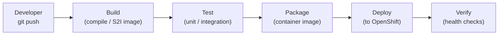
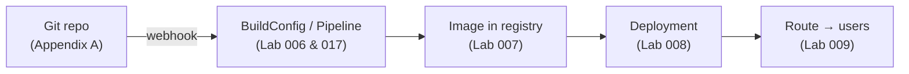

# Appendix B: CI/CD for Beginners

> Maps to the video course *"APPENDIX B – CICD for Beginners"*.
> The concepts behind Continuous Integration and Continuous Delivery - the
> foundation for the hands-on [Lab 017: CI/CD Pipelines](../017-cicd-pipelines/README.md).

## What problem does CI/CD solve?

Manually building, testing, and deploying software is slow and error-prone.
**CI/CD** automates the path from a code change to a running application, so every
commit is verified and shippable.

- **Continuous Integration (CI)** - every code change is automatically built and
  tested, catching problems early.
- **Continuous Delivery (CD)** - every change that passes CI is automatically
  prepared (and optionally deployed) for release.

## The pipeline



Each stage runs automatically; a failure stops the pipeline and alerts the team.

## Key concepts

| Term | Meaning |
|---|---|
| **Pipeline** | An automated sequence of stages from commit to deploy |
| **Stage / Task** | A single step (build, test, deploy) |
| **Trigger** | What starts a pipeline - usually a Git push (webhook) |
| **Artifact** | The output of a build - for OpenShift, a container image |
| **Environment** | Where you deploy - dev, staging, production |

## CI/CD on OpenShift

OpenShift gives you two main engines, both covered hands-on in Lab 017:

### 1. OpenShift Pipelines (Tekton) - cloud-native
Pipelines run as Pods inside the cluster; each Task is a container. Defined
declaratively in YAML - no separate server to maintain.

```yaml
apiVersion: tekton.dev/v1
kind: Pipeline
metadata:
  name: build-and-deploy
spec:
  tasks:
  - name: build
    taskRef:
      name: s2i-build
  - name: deploy
    runAfter: [build]
    taskRef:
      name: openshift-deploy
```

### 2. Jenkins - traditional
OpenShift ships a Jenkins template with a Kubernetes plugin that spins up build
agents as Pods on demand.

```bash
oc new-app jenkins-persistent
```

## How the pieces connect



This chain is exactly what the numbered labs build up, one link at a time.

## Next

- Set up the source side: [Appendix A: Source Code Management](source-code-management.md)
- Build it for real: [Lab 017: CI/CD Pipelines](../017-cicd-pipelines/README.md)
