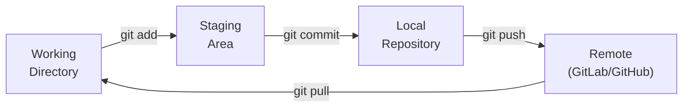

# Appendix A: Source Code Management for Beginners (Git & GitLab)

> Maps to the video course *"APPENDIX A – Source Code Management for Beginners"*
> and its *"Demo – GitLab Setup"*.
> OpenShift builds images **from source**, so a Git repository is the starting
> point of most CI/CD workflows.

## Why source code management?

Source Code Management (SCM) tracks **every change** to your code over time,
lets teams collaborate without overwriting each other, and provides the trigger
for automated builds. **Git** is the de-facto standard; **GitLab** and **GitHub**
are hosting platforms built around it.

OpenShift ties directly into this: a `BuildConfig` points at a Git repo, and a
**webhook** kicks off a new build every time you push (see
[Lab 006](../006-hooks-setup/README.md)).

## Git in five minutes



### The essential commands

```bash
# Configure your identity (once per machine)
git config --global user.name  "Your Name"
git config --global user.email "you@example.com"

# Start tracking a project
git init
git add .                     # stage all changes
git commit -m "Initial commit"

# Connect to a remote and publish
git remote add origin https://gitlab.com/youruser/myapp.git
git push -u origin main

# Everyday cycle
git status                    # what changed?
git add <file>                # stage specific changes
git commit -m "Describe change"
git pull                      # get others' changes
git push                      # share yours
```

### Branching (work in isolation)

```bash
git checkout -b feature/login   # create & switch to a branch
# ...make changes, commit...
git push -u origin feature/login
# open a Merge Request / Pull Request to merge back into main
```

## GitLab setup (self-hosted demo)

The course demonstrates running GitLab yourself. You can do the same locally with
the official container image:

```bash
docker run --detach \
  --hostname gitlab.local \
  --publish 8443:443 --publish 8080:80 --publish 2222:22 \
  --name gitlab \
  --restart always \
  gitlab/gitlab-ce:latest

# Retrieve the initial root password
docker exec -it gitlab grep 'Password:' /etc/gitlab/initial_root_password
```

Then browse to `http://localhost:8080`, log in as `root`, create a project, and
push your code:

```bash
git remote add origin http://localhost:8080/root/myapp.git
git push -u origin main
```

## Connecting Git to OpenShift

Once your code is in Git, OpenShift can build and deploy it directly:

```bash
# Build and deploy straight from a Git repository (Source-to-Image)
oc new-app https://gitlab.com/youruser/myapp.git --name=myapp
oc expose svc/myapp
```

For private repositories, store credentials in a Secret and link it to the build
(covered in [Lab 013: ConfigMaps & Secrets](../013-configmaps-secrets/README.md)).

## Next

- Wire push events to automatic builds: [Lab 006: Build Hooks](../006-hooks-setup/README.md)
- Understand the automation pipeline: [Appendix B: CI/CD for Beginners](cicd-for-beginners.md)
