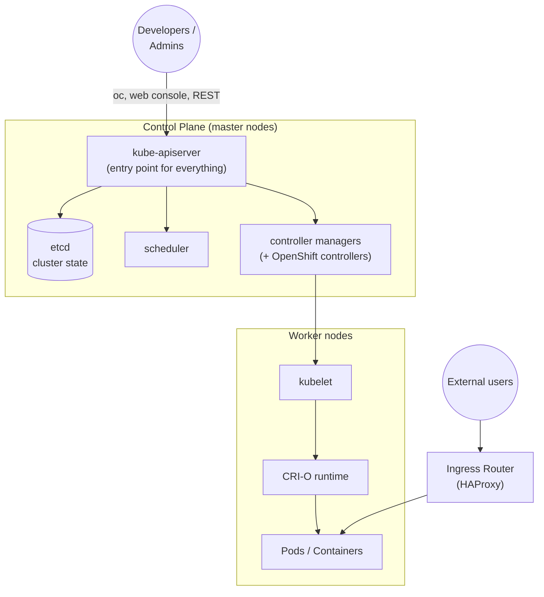

# Concepts: OpenShift Architecture Overview

> Conceptual primer - maps to the video course section *"OpenShift – Architecture Overview"*.
> Read this before the hands-on labs to understand what runs where and why.

## What is OpenShift?

OpenShift is Red Hat's enterprise Kubernetes platform. It takes upstream
Kubernetes and adds the pieces you need to run it in production: an opinionated
installer, an integrated container registry, developer build tooling
(Source-to-Image), a web console, tighter default security, and first-class
concepts like **Projects** and **Routes**.

> **One-line mental model:** *OpenShift = Kubernetes + security defaults +
> developer workflow + operations tooling, all supported as one product.*

## The cluster at a glance

## Core components

### Control plane (master)
- **API Server** - the single front door. Every request (`oc`, web console, REST,
  controllers) goes through it. This is what you authenticate to with your token.
- **etcd** - the key-value store holding the entire desired and observed state of
  the cluster.
- **Scheduler** - decides which node each new Pod lands on based on resources,
  affinity, and constraints.
- **Controllers** - reconcile loops that drive actual state toward desired state
  (Deployments creating ReplicaSets, etc.). OpenShift adds its own controllers for
  Routes, Builds, ImageStreams, and more.

### Worker nodes
- **kubelet** - the node agent that starts/stops containers and reports health.
- **CRI-O** - OpenShift's lightweight OCI container runtime (the Docker replacement).
- **Pods** - the smallest deployable unit; one or more containers sharing network
  and storage.

### OpenShift-specific building blocks
| OpenShift concept | Purpose | Kubernetes equivalent |
|---|---|---|
| **Project** | A namespace with extra annotations and self-service access | Namespace |
| **Route** | Externally reachable URL for a Service, with TLS | Ingress |
| **ImageStream** | Tracks and triggers on container image changes | (none) |
| **BuildConfig** | Defines how to turn source/Docker into an image (S2I) | (none) |
| **DeploymentConfig** | Legacy deploy object with triggers/hooks | Deployment |
| **SCC** | Security Context Constraints - what a Pod is allowed to do | PodSecurity |

## How a request flows

1. You authenticate to the **API Server** (via `oc login` and a token).
2. You create objects (Deployment, Service, Route) - stored in **etcd**.
3. **Controllers** notice the new Deployment and create Pods.
4. The **Scheduler** places Pods on worker nodes; **kubelet** starts them via CRI-O.
5. A **Service** gives the Pods a stable internal address.
6. A **Route** exposes the Service through the **Ingress Router** to the outside world.

## Security by default

Unlike vanilla Kubernetes, OpenShift ships locked down:
- Containers run as a **random non-root UID** under the `restricted-v2` SCC.
- Root, host mounts, and privileged containers are denied unless explicitly granted.
- This is why some community images (e.g. official `postgres`) need an adjusted
  SCC - see [Lab 021](../021-example-voting-app/README.md).

## Where to go next

- Set up your own cluster in [Lab 000: Setup & Token](../000-SetupToken/README.md)
- Learn the client tools in [Concepts: OpenShift Management](openshift-management.md)
- Review the container basics in [Concepts: Docker Overview](docker-overview.md)
