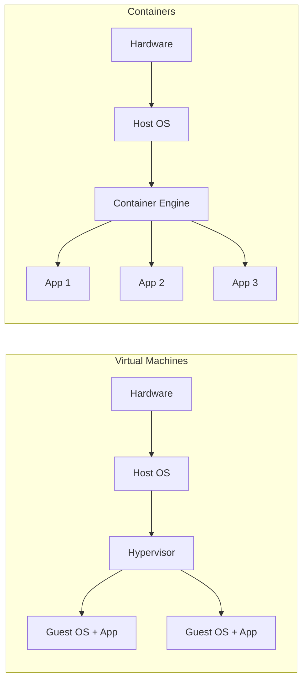

# Concepts: Docker Overview

> Conceptual primer - maps to the video course section *"Pre-Requisite – Docker Overview"*.
> A quick refresher on containers before you build and run them on OpenShift.

## Why containers?

A container packages an application **together with everything it needs to run**
- code, runtime, libraries, and settings - into a single, portable unit. Unlike a
virtual machine, containers share the host operating system kernel, so they start
in milliseconds and use far fewer resources.



## Key terms

| Term | Meaning |
|---|---|
| **Image** | A read-only template (layers) used to create containers |
| **Container** | A running (or stopped) instance of an image |
| **Dockerfile** | A recipe describing how to build an image |
| **Registry** | A store for images (Docker Hub, Quay, the OpenShift internal registry) |
| **Tag** | A named version of an image, e.g. `nginx:alpine` |
| **Layer** | A cached filesystem diff; images are stacks of layers |

## The core workflow

```bash
# 1. Build an image from a Dockerfile
docker build -t myapp:1.0 .

# 2. Run a container from the image
docker run -d -p 8080:8080 --name myapp myapp:1.0

# 3. List running containers
docker ps

# 4. Inspect logs
docker logs myapp

# 5. Push to a registry so others (and OpenShift) can pull it
docker tag myapp:1.0 docker.io/youruser/myapp:1.0
docker push docker.io/youruser/myapp:1.0
```

## A minimal Dockerfile

```dockerfile
# Start from a small base image
FROM python:3.12-slim

# Set the working directory inside the image
WORKDIR /app

# Copy and install dependencies first (better layer caching)
COPY requirements.txt .
RUN pip install --no-cache-dir -r requirements.txt

# Copy the application code
COPY . .

# Document the port the app listens on
EXPOSE 8080

# Define the default command
CMD ["python", "app.py"]
```

## How this maps to OpenShift

- OpenShift **runs** these same OCI images, but with **CRI-O** instead of the
  Docker daemon.
- You rarely write `docker run` on OpenShift - instead you create a `Deployment`
  that references the image (see [Lab 008](../008-deploying/README.md)).
- OpenShift can even build images **for** you from source using **Source-to-Image
  (S2I)** - no Dockerfile required (see [Lab 005](../005-docker-pipeline/README.md)).
- Remember OpenShift's security default: images must tolerate running as a
  **random non-root UID**.

## Hands-on next

- [Lab 004: Docker Lifecycle](../004-docker-lifecycle/README.md) - build, tag, push, run
- [Concepts: Kubernetes Overview](kubernetes-overview.md) - how containers are orchestrated
