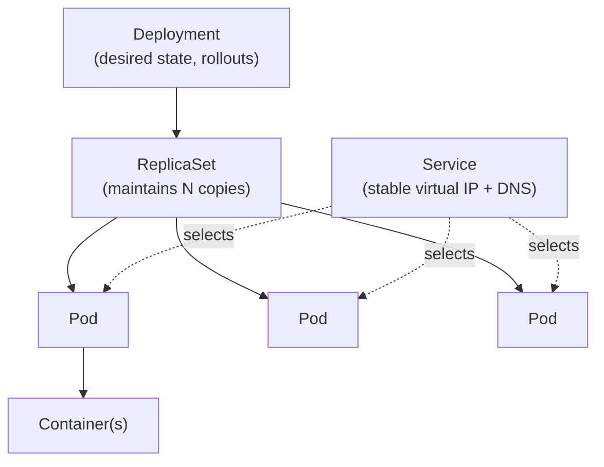

# Concepts: Kubernetes Overview

> Conceptual primer - maps to the video course section *"Pre-Requisite – Kubernetes Overview"*.
> Understand the orchestration model that OpenShift is built on.

## Why Kubernetes?

Running one container is easy. Running **hundreds** across many machines - keeping
them healthy, scaled, connected, and updated with zero downtime - is hard.
Kubernetes is the orchestrator that automates all of that. OpenShift is a
distribution of Kubernetes, so every concept here applies directly.

## The object hierarchy



## Core objects you must know

| Object | What it does |
|---|---|
| **Pod** | Smallest unit - one or more containers sharing network/storage |
| **ReplicaSet** | Ensures a set number of identical Pods are always running |
| **Deployment** | Declaratively manages ReplicaSets; handles rolling updates & rollback |
| **Service** | Gives a group of Pods one stable IP and DNS name (load balancing) |
| **ConfigMap / Secret** | Inject configuration and sensitive data into Pods |
| **PersistentVolumeClaim** | Requests durable storage that survives Pod restarts |
| **Namespace** | Logical isolation boundary (OpenShift calls this a *Project*) |

## The declarative model

You describe **what** you want in YAML; Kubernetes continuously works to make
reality match. You don't script the steps - you declare the end state.

```yaml
apiVersion: apps/v1
kind: Deployment
metadata:
  name: web
spec:
  replicas: 3            # I want 3 copies, always
  selector:
    matchLabels:
      app: web
  template:
    metadata:
      labels:
        app: web
    spec:
      containers:
      - name: web
        image: nginx:alpine
        ports:
        - containerPort: 80
```

If a Pod crashes or a node dies, the controller notices the count dropped below 3
and creates a replacement automatically - this is the **reconciliation loop**.

## Service discovery

Pods are ephemeral and get new IPs when recreated. A **Service** provides a stable
name so components can find each other reliably:

```bash
# Any pod in the same namespace can reach the "web" pods simply via:
curl http://web
```

This is exactly how the tiers in [Lab 021](../021-example-voting-app/README.md)
talk to `redis` and `db` - by Service name, never by IP.

## What OpenShift adds on top

| Kubernetes | OpenShift addition |
|---|---|
| Namespace | **Project** (self-service, quotas, annotations) |
| Ingress | **Route** (simpler external URLs with TLS) |
| Manual image refs | **ImageStream** + **BuildConfig** (S2I builds) |
| PodSecurity | **Security Context Constraints (SCC)** |
| `kubectl` | `oc` (a superset of `kubectl`) |

## Next

- [Concepts: OpenShift Architecture](architecture-overview.md)
- [Concepts: OpenShift Management](openshift-management.md) - `oc`, web console, REST API
- Hands-on: [Lab 008: Deployments](../008-deploying/README.md)
