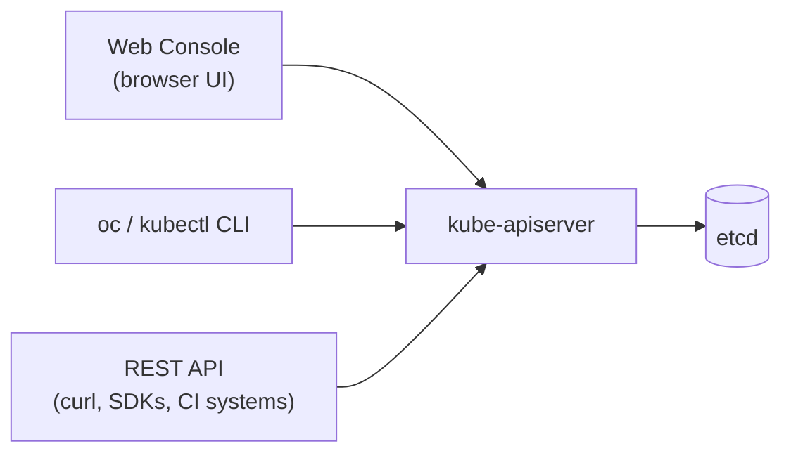

# Concepts: OpenShift Management (Web Console, CLI & REST API)

> Conceptual primer - maps to the video course section
> *"Management – Web, CLI and REST API"*.
> There are three ways to talk to an OpenShift cluster - all of them go through
> the same API Server.



Everything you do - click in the console, run an `oc` command, or send a raw HTTP
request - becomes an authenticated call to the **API Server**. Pick whichever
interface fits the task.

## 1. The Web Console

A browser-based UI with two perspectives:

- **Administrator** - cluster-wide view: nodes, operators, projects, RBAC, quotas.
- **Developer** - application-centric: Topology view, +Add, builds, and routes.

Best for: exploring, visualizing topology, and guided workflows. You obtain your
login token from the console (see [Lab 000](../000-SetupToken/README.md)).

## 2. The `oc` CLI

`oc` is OpenShift's command-line client - a **superset of `kubectl`** that adds
OpenShift-specific verbs (`oc new-app`, `oc new-project`, `oc expose`, `oc adm`).

```bash
# Log in with a token (copied from the web console)
oc login --token=sha256~XXXX --server=https://api.crc.testing:6443

# Who am I and where am I?
oc whoami
oc project

# Explore resources
oc get pods
oc get all
oc describe deployment/myapp

# Create an app from an image in one command
oc new-app docker.io/nirgeier/simple-web-app:latest --name=web
oc expose svc/web

# Anything kubectl can do, oc can do too
oc apply -f manifest.yaml
```

Best for: everyday work, scripting, and automation.

## 3. The REST API

The console and CLI are just clients of the underlying REST API. You can call it
directly - useful for custom tooling, CI systems, and integrations.

```bash
# Grab your current token and the API server URL
TOKEN=$(oc whoami -t)
API=$(oc whoami --show-server)

# List pods in the current project via raw REST
curl -sk -H "Authorization: Bearer $TOKEN" \
  "$API/api/v1/namespaces/$(oc project -q)/pods" | jq '.items[].metadata.name'
```

- `/api/v1/...` - core objects (Pods, Services, ConfigMaps)
- `/apis/apps/v1/...` - Deployments, ReplicaSets
- `/apis/route.openshift.io/v1/...` - OpenShift Routes

Best for: programmatic access, dashboards, and custom controllers.

## Which one should I use?

| Task | Best interface |
|---|---|
| Learning / visualizing topology | Web Console |
| Day-to-day operations & scripting | `oc` CLI |
| Automation inside pipelines | `oc` CLI or REST API |
| Building custom tools/integrations | REST API / SDK |

## Next

- Get your token and log in: [Lab 000: Setup & Token](../000-SetupToken/README.md)
- Verify the cluster with the CLI: [Lab 001: Verify Cluster](../001-verify-cluster/README.md)
